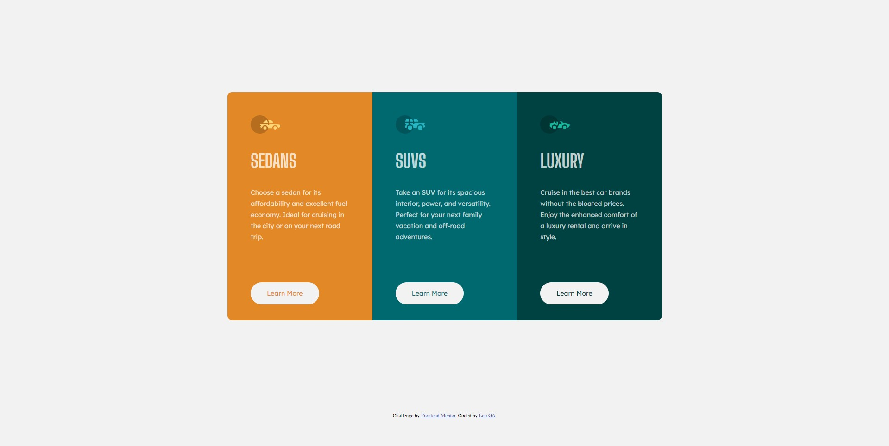
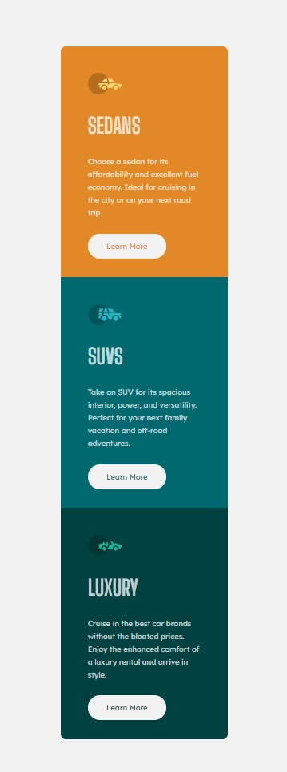

# Frontend Mentor - 3-column preview card component solution

This is a solution to the [3-column preview card component challenge on Frontend Mentor](https://www.frontendmentor.io/challenges/3column-preview-card-component-pH92eAR2-). Frontend Mentor challenges help you improve your coding skills by building realistic projects. 

## Table of contents
  - [The challenge](#the-challenge)
  - [Screenshot](#screenshot)
  - [Links](#links)
  - [Built with](#built-with)
  - [Author](#author)

### The challenge

Users should be able to:

- View the optimal layout depending on their device's screen size
- See hover states for interactive elements

### Screenshot

### Links

- Solution URL: [github repo](https://github.com/leoguido/3-column-project)
- Live Site URL: [netlify site](https://column-design.netlify.app/)

### Built with

- Semantic HTML5 markup
- CSS custom properties
- Flexbox
- Mobile-first workflow
- [Normalize](https://necolas.github.io/normalize.css/)

## Author

- Github - [leoguido](https://github.com/leoguido)
- Frontend Mentor - [@leoguido](https://www.frontendmentor.io/profile/leoguido)
- Twitter - [@Leo_cuul](https://twitter.com/Leo_cuul)
